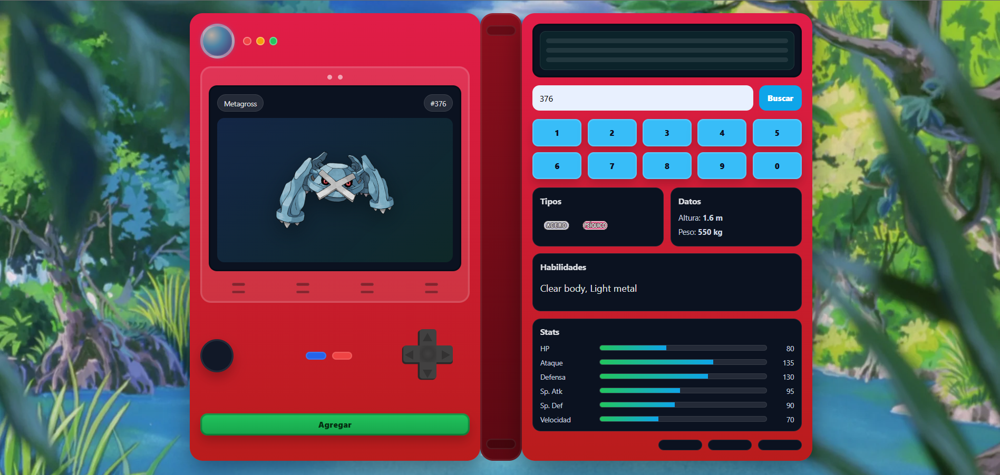
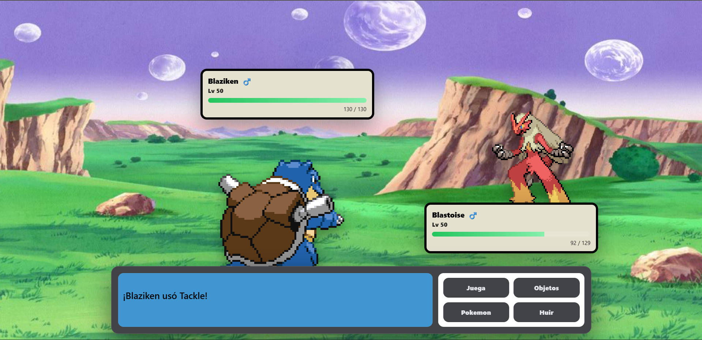

# 🧩 Pokédex & Battle System (Pokémon GBA Style)

Una aplicación web inspirada en **Pokémon Rojo Fuego (GBA)** que combina una **Pokédex interactiva** con un **sistema de combates por turnos**, desarrollada completamente con tecnologías web estándar y consumiendo **PokeAPI**.

---

## 🎮 ¿Qué hace esta aplicación?

La aplicación está dividida en dos grandes módulos:

### 📱 Pokédex
- Búsqueda de Pokémon por **nombre o ID**
- Interfaz inspirada en una **Pokédex física**
- Visualización de:
  - Sprite
  - Tipos
  - Estadísticas
  - Género (♂ / ♀ con probabilidad especial)
- Gestión de equipo:
  - Agregar hasta **6 Pokémon**
  - Evita duplicados
  - Asignar mote (nickname)
- Persistencia del equipo usando **localStorage**
- **Diseño responsivo** (adaptado a desktop y móvil)

---

### ⚔️ Sistema de Combate
- Combates estilo **Pokémon Rojo Fuego**
- Intro animada tipo *VS*
- Combate por turnos:
  - Ataques
  - Cambio de Pokémon
  - KO y reemplazo automático
- HUD clásico:
  - Nombre
  - Nivel
  - HP dinámico
  - Género
- Modal de cambio de Pokémon estilo GBA
- Música y efectos de sonido:
  - Música de combate
  - Sonido de victoria
- Sistema de **victoria y derrota**:
  - Revancha
  - Volver al menú
- **Diseño NO responsivo** (enfoque actual en experiencia tipo consola)

---

## 🧠 Características Técnicas
- Probabilidad especial:
  - ✨ 1% de Pokémon shiny
  - ♀ 0.12% de Pokémon hembra (el resto macho)
- Sistema de daño y efectividad por tipo
- Estado de HP persistente durante el combate
- Bloqueo de inputs para evitar acciones simultáneas
- Navegación por teclado (↑ ↓ Enter)

---

## 🛠️ Tecnologías utilizadas

- 🧱 **HTML5**
- 🎨 **CSS3** (sin frameworks)
- ⚙️ **JavaScript Vanilla**
- 🌐 **PokeAPI**
- 💾 **localStorage**
- 🔊 Audio HTML5

> ❌ No se utilizan frameworks por ahora  
> ✅ Todo el sistema está construido con **JS puro**

---

## 📐 Diseño Responsivo

| Sección | Estado |
|------|------|
| Pokédex | ✅ Responsiva |
| Combates | ❌ No responsiva |

> ⚠️ **Nota:**  
> El módulo de combates está diseñado con enfoque **estilo consola GBA**, por lo que actualmente no es responsivo.

📌 **Próximamente** se integrarán frameworks y/o nuevas arquitecturas para hacer **todo el sistema completamente responsivo**.

---

## 🚧 Estado del proyecto

🔄 En desarrollo activo  
🔜 Mejoras planeadas:
- Responsividad total
- Animaciones más avanzadas
- Sistema de objetos
- Estados alterados
- IA más compleja
- Posible migración a frameworks modernos

---

## 📷 Preview
### Pokédex

### Combate

---

## 👨‍💻 Autor
Proyecto desarrollado con fines educativos y de práctica avanzada en desarrollo frontend.

---

⭐ Si te gusta el proyecto, ¡no olvides darle una estrella en GitHub!
